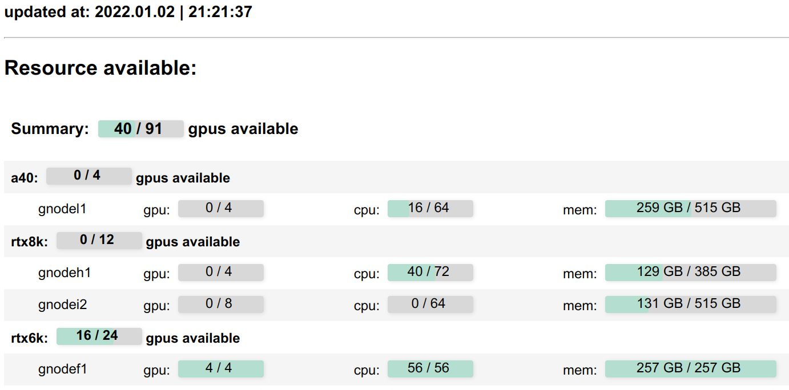

# Slurm Website Monitor for UVA Rivanna
A website-based resource monitor for [SLURM](https://slurm.schedmd.com/documentation.html) systems, tailored specifically for the UVA Rivanna computing environment.

This project extends the original implementation developed for the [Visual Geometry Group](https://www.robots.ox.ac.uk/~vgg/), Oxford, with enhancements and customizations to better serve the specific needs of our research group at the University of Virginia.

## Features
- Parses the results from the `sinfo` command every 1 seconds to update CPU/GPU resource usage.
- Hosts statistics on an internally accessible webpage, providing a convenient overview of system status.

## Screenshot


## News
- [10/31/2024]: Launched customized version for UVA Rivanna.

## Installation
To install necessary dependencies, run:
```
pip install -r requirements.txt
```

## Usage
To launch the web monitor:
```
python app.py --host localhost --port 8080
```
Access the website at `localhost:8080`. Adjust the host and port as needed for your setup.

Modify the [index.html](index.html) to customize the header, footer, and formatting to suit your group's preferences.

## Command-Line Tool
For command-line usage:
```
python slurm_web/slurm_gpustat.py
```

Alternatively, add this alias to your `.bash_profile`:
```
alias slurm_gpustat=‘python ~/slurm_web/slurm_gpustat.py’
```

## Credits
This project is based on the original `slurm_gpustat` tool developed by [Samuel Albanie](https://github.com/albanie/slurm_gpustat) and `slurm_web
` developed by [Tengda Han](https://tengdahan.github.io/). It has been modified and maintained for the UVA Rivanna system by the UVA CV Lab, with the aim of providing enhanced monitoring tools for Rivanna.

## Reference
Further documentation and updates can be found at the original [slurm_gpustat repository](https://github.com/albanie/slurm_gpustat).
